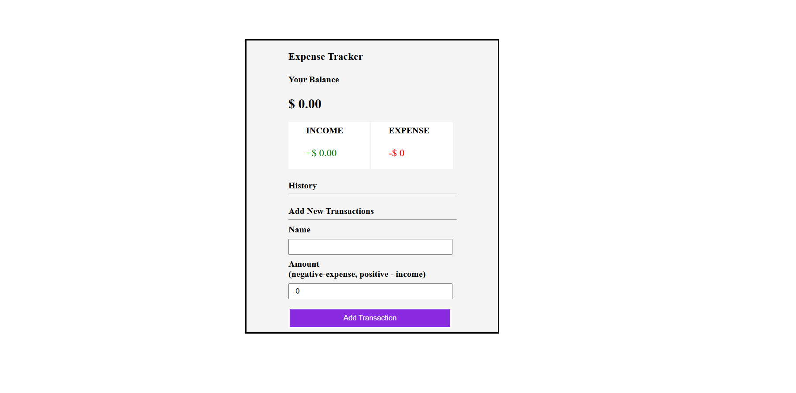

# Expense Tracker

This is a single-page web application that helps users track their income and expenses. Built with React and `useContext` for state management, it allows users to add and delete transactions, calculates the balance, and provides a summary of total income and expenses.

Live Demo: [Expense Tracker](https://expensetracker987.netlify.app/)

---

## Features

- **Real-time Balance Calculation**: Displays the current balance after each transaction.
- **Income & Expense Summary**: Shows separate totals for income and expenses.
- **Transaction History**: Lists all transactions with color-coded labels (green for income, red for expenses).
- **Add Transaction**: Users can add a new transaction by specifying the name and amount (positive for income, negative for expense).
- **Delete Transaction**: Users can remove any transaction from the history.

---

## Page Layout

The layout includes the following sections:

1. **Balance Display**:
   - Shows the current balance calculated from the total income and expenses.

2. **Income and Expense Summary**:
   - Displays two sections side-by-side with the total income and total expense, color-coded for clarity.
   
3. **Transaction History**:
   - Lists each transaction, showing the name, amount, and color-coded indicator (green for income, red for expense).

4. **Add New Transaction**:
   - Contains input fields for the transaction name and amount.
   - Users can specify a positive amount for income and a negative amount for expense.

---

## Components

- **Balance**: Shows the current balance.
- **IncomeExpenseSummary**: Displays income and expense totals in a grid layout.
- **TransactionList**: Renders a list of all transactions with delete functionality.
- **AddTransactionForm**: Provides input fields for adding new transactions.

---

## Technologies Used

- **React**: For building the user interface.
- **useContext**: For managing the global state of transactions, balance, income, and expense.
- **CSS**: For styling and layout adjustments.

---

## How to Use

1. **View Balance**: The balance is displayed at the top, showing the result of all transactions.
2. **Add a Transaction**:
   - Enter a name and amount in the "Add New Transaction" section.
   - Positive amounts are treated as income, while negative amounts are treated as expenses.
   - Click "Add Transaction" to add it to the list.
3. **Delete a Transaction**: 
   - Each transaction in the history has a delete option to remove it from the list.

## Example Screenshot

()
